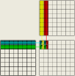
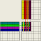

# Exercises chapter 5

1. Consider matrix addition. Can one use shared memory to reduce the global memory bandwidth consumption? Hint: Analyze the elements that are accessed by each thread and see whether there is any commonality between threads.

    No, there is no commonality in data access between threads, so shared memory is not useful for reducing global memory bandwith in this scenario.

2. Draw the equivalent of Fig. 5.7 for a 8x8 matrix multiplication with 2x2 tiling and 4x4 tiling. Verify that the reduction in global memory bandwidth is indeed proportional to the dimension size of the tiles.

    |2x2| 4x4|
    |--|--|
    |  |  |

3. What type of incorrect execution behavior can happen if one forgot to use one or both __syncthreads() in the kernel of Fig. 5.9?

    The first __syncthreads is due a read-after-write dependency and the second one is dua a write-after-read. That means that without the first __syncthreads the code migth actually do calculations with memory garbage and, without the second __syncthreads, the code could potentially overwrite data before it should.

4. Assuming that capacity is not an issue for registers or shared memory, give one important reason why it would be valuable to use shared memory instead of registers to hold values fetched from global memory? Explain your answer.
  
    Shared memory is public among the threads in the same block and the registers are private to each thread. That means that registers couldn't be used to tiling even if they were ilimited. So, shared memory would still be useful to reduce global memory bandwith consumption.

5. For our tiled matrix-matrix multiplication kernel, if we use a 32x32 tile, what is the reduction of memory bandwidth usage for input matrices M and N?

    The reduction factor is 32.

6. Assume that a CUDA kernel is launched with 1000 thread blocks, each of which has 512 threads. If a variable is declared as a local variable in the kernel, how many versions of the variable will be created through the lifetime of the execution of the kernel?

    $512 \times 1000 = 512,000 \text{ variables}$

7. In the previous question, if a variable is declared as a shared memory variable, how many versions of the variable will be created through the lifetime of the execution of the kernel?

    $1000 \text{ variables}$.

8. Consider performing a matrix multiplication of two input matrices with dimensions NxN. How many times is each element in the input matrices requested from global memory when: 
    
    1. There is no tiling? 
        
        $N \text{ times}$

    2. Tiles of size TxT are used?

        $N \div T \text{ times}$

9. A kernel performs 36 floating-point operations and seven 32-bit global memory accesses per thread. For each of the following device properties, indicate whether this kernel is compute-bound or memory bound. 
    1. Peak FLOPS=200 GFLOPS, peak memory bandwidth=100 GB/second 


        $$
        \begin{aligned}
        7 \times 32 \text{ bit } &= 28 \text{ bytes} \\

        \frac{36 \text{FPLOP}}{28 \text{B}} &\approx 1.286 \text{ FLOP/B} \\

        1.286 \text{ FLOPS/B} \times 100 \text{ GB/S} &= 128.6 \text{ GFLOPS}
        \end{aligned}
        $$


        As $128.6  \text{ GFLOPS} < 200 \text{ GFLOPS}$, the kernel is memory bound.


    2. Peak FLOPS=300 GFLOPS, peak memory bandwidth=250 GB/second
        $$
        1.286 \text{ FLOPS/B} \times 250 \text{ GB/S} = 321.5\text{ GFLOPS} 
        $$
        
        As $321.5  \text{ GFLOPS} > 250 \text{ GFLOPS}$, the kernel is memory bound.

10. To manipulate tiles, a new CUDA programmer has written a device kernel that will transpose each tile in a matrix. The tiles are of size BLOCK_WIDTH by BLOCK_WIDTH, and each of the dimensions of matrix A is known to be a multiple of BLOCK_WIDTH. The kernel invocation and code are shown below. BLOCK_WIDTH is known at compile time and could be set anywhere from 1 to 20.

    ```c
    01. dim3 blockDim(BLOCK_WIDTH, BLOCK_WIDTH);
    02. dim3 gridDim(A_width / blockDim.x, A_height / blockDim.y);
    03. BlockTranspose<<<gridDim, blockDim>>>(A, A_width, A_height);

    04. __global__ void
    05. BlockTranspose(folat *A_elements, int A_width, int A_height)
    06.{
    07.     __shared__ float blockA[BLOCK_WIDTH][BLOCK_WIDTH];
    
    08.     int baseIdx = blockIdx.x * BLOCK_WIDTH + threadIdx.x;
    09.     baseIdx += (blockIdx.y * BLOCK_WIDTH + threadIdx.y) * A_width;

    10.     blockA[threadIdx.y][threadIdx.x] = A_elements[baseIdx];

    11.     A_elements[baseIdx] = blockA[threadIdx.x][threadIdx.y];
    12.}
    ```

    1. Out of the possible range of values for BLOCK_WIDTH, for what values of BLOCK_WIDTH will this kernel function execute correctly on the device? 

        It will execute correctly only for block width of 1.

    
    2. If the code does not execute correctly for all BLOCK_WIDTH values, what is the root cause of this incorrect execution behavior? Suggest a fix to the code to make it work for all BLOCK_WIDTH values.

        The problem is the use of the shared memory, the blocks can try to read values before they are loaded from the global memory in line 11. The solution is to __syncthreads().

    ```c
    01. dim3 blockDim(BLOCK_WIDTH, BLOCK_WIDTH);
    02. dim3 gridDim((A_width + blockDim.x - 1) / blockDim.x, 
        (A_height + blockDim.y - 1) / blockDim.y);
    03. BlockTranspose<<<gridDim, blockDim>>>(A, A_width, A_height);

    04. __global__ void
    05. BlockTranspose(folat *A_elements, int A_width, int A_height)
    06.{
    07.     __shared__ float blockA[BLOCK_WIDTH][BLOCK_WIDTH];
    
    08.     int baseIdx = blockIdx.x * BLOCK_WIDTH + threadIdx.x;
    09.     baseIdx += (blockIdx.y * BLOCK_WIDTH + threadIdx.y) * A_width;

    10.     blockA[threadIdx.y][threadIdx.x] = A_elements[baseIdx];

    11.     __syncthreads();

    12.     A_elements[baseIdx] = blockA[threadIdx.x][threadIdx.y];
    13.}

11. Consider the following CUDA kernel and the corresponding host function that calls it:

    ```c
    01. __global__ void foo_kernel(float *a, float *b) {
    02.     unsigned int i = blockIdx.x * blockDim.x + threadIdx.x;
    03.     float x[4];
    04.     __shared__ float y_s;
    05.     __shared__ float b_s[128];
    06.     for(unsigned int j = 0; j < 4; ++j) {
    07.         x[j] = a[j* blockDim.x  * gridDim.x + i]; // 4 loads
    08.     }
    09.     if (threadIdx.x == 0) {
    10.         y_s = 7.4f;
    11.     }
    12.     b_s[threadIdx.x] = b[i]; // 1 load
    13.     __syncthreads();
    14.     b[i] = 2.5f * x[0] + 3.7 * x[1] + 6.3f * x[2] + 8.5f * x[3]
    15.             + y_s * b_s[threadIdx.x] + b_s[(threadIdx.x + 3) % 128]; // 1 write
    16. }
    17. void foo(int *a_d, int *b_d) {
    18.     unsigned int N = 1024;
    19.     foo_kernel <<<(N + 128 - 1) / 128, 128>>> (a_d, b_d);
    20. }
    ```
    1. How many versions of the variable i are there?
        
        The same number of total threads: 1024.

    2. How many versions of the array x[] are there? 

        The same number of total threads as well: 1024.

    3. How many versions of the variable y_s are there? 

        The same as the number of blocks in a grid: $\lceil 1024 \div 128\rceil = 8 $

    4. How many versions of the array b_s[] are there?

        The same as the number of blocks in a grid: $\lceil 1024 \div 128\rceil = 8 $
    
    5. What is the amount of shared memory used per block (in bytes)?

        $128 \times 4 + 4 = 516 \text{ bytes}$
    
    6. What is the floating-point to global memory access ratio of the kernel (in OP/B)?
        
        - There are 4 loads in line 07, 1 load in line 12 and 1 write in 14, all float variables (4 bytes).
        - There are 10 float point operations in line 14, 

        $10 \div (6 \times 4) \approx 0.417 \text{ OP/B}$

12. Consider a GPU with the following hardware limits: 2048 threads/SM, 32 blocks/SM, 64K (65,536) registers/SM, and 96 KB of shared memory/SM. For each of the following kernel characteristics, specify whether the kernel can achieve full occupancy. If not, specify the limiting factor. 

    1. The kernel uses 64 threads/block, 27 registers/thread, and 4 KB of shared memory/SM. 

        The shared memory is a limiting factor.

        $\begin{aligned}
            2048 \text{ threads} \div 64 \text{ threads / block}  &= 32 \text{ blocks} \\
            32 \text{ blocks} \times 4 \text{ KB shared memory/SM} &= 128 \text{ KB/SM} \\
            128 \text{ KB/SM} &> 96 \text{ KB/SM}
        \end{aligned}$


    2. The kernel uses 256 threads/block, 31 registers/thread, and 8 KB of shared memory/SM.

        It can reach full occupancy.